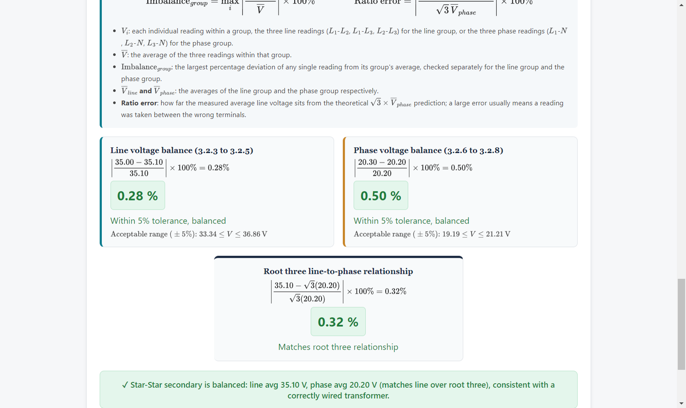
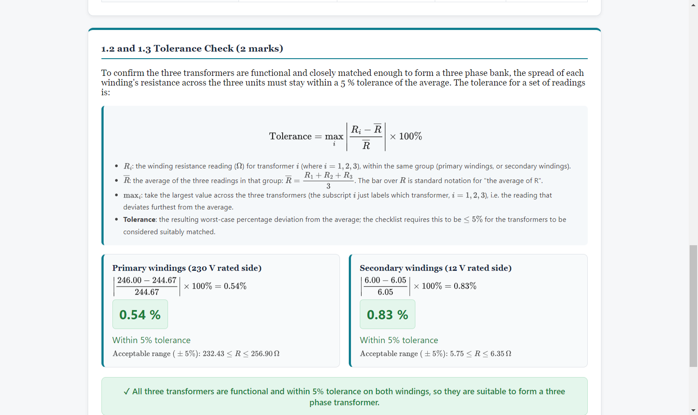
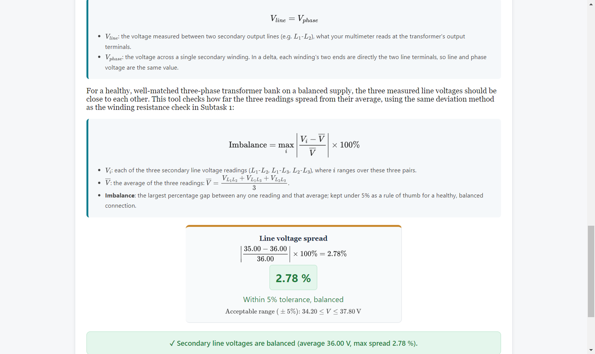
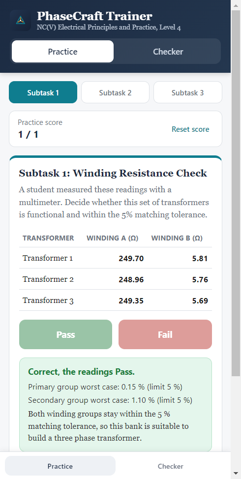
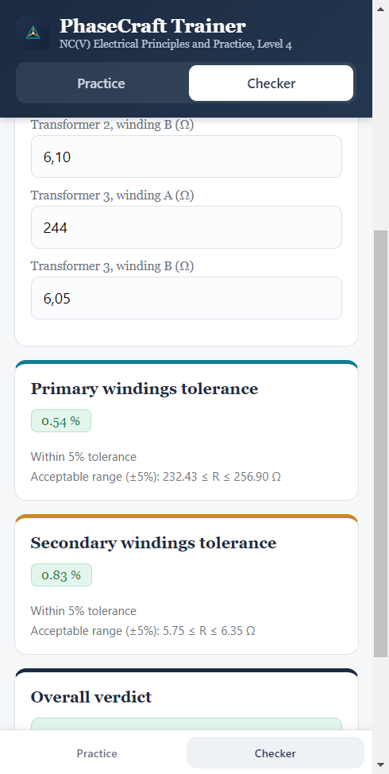

<div align="center">

# PhaseCraft

**Three-phase transformer verification tool for lecturers (Windows) and practice trainer for students (Android)**<br>
NC(V) Electrical Principles and Practice · Level 4 · Practical Assessment Task 2 · South African TVET

[](https://github.com/Manofork/phasecraft-pat2/actions/workflows/ci.yml)
[](https://github.com/Manofork/phasecraft-pat2/releases/latest)
[](https://github.com/Manofork/phasecraft-pat2/releases)
[](LICENSE)




</div>

## Contents

- [About](#about)
- [Features](#features)
- [Download](#download)
- [Build from source](#build-from-source)
- [Using the tool](#using-the-tool)
- [Theory](#theory)
- [Project structure](#project-structure)
- [Contributing](#contributing)
- [Releasing](#releasing)
- [Troubleshooting](#troubleshooting)
- [Acknowledgements](#acknowledgements)
- [Author](#author)
- [Licence](#licence)

## About

PhaseCraft turns the paper based ICASS Practical Assessment Task 2 (PAT 2) of NC(V) Electrical Principles and
Practice, Level 4, into a digital checklist. In the task, students construct a three-phase transformer from three
single-phase transformers and connect it in Star-Delta and Star-Star configurations, taking multimeter readings at
each stage.

PhaseCraft is published in two editions:

- **PhaseCraft Desktop (Windows)** is built for lecturers. The lecturer enters a student's multimeter readings and
  receives the same pass or fail decision that the official checklist gives, together with the worked calculation and
  a PDF report.
- **PhaseCraft Trainer (Android)** is built for students. It lets them practise diagnosing readings on their own
  phones, fully offline, and check their own workshop readings.

> **Notice.** PhaseCraft is a teaching aid. Results are advisory; official assessment decisions remain with the
> lecturer and must be verified against the official assessment guidelines. The author accepts no responsibility for
> errors arising from incorrect input values or from use outside the intended context.

## Features

**Desktop (Windows)**

- Three subtasks: Subtask 1 Planning (winding resistance), Subtask 2 Star-Delta and Subtask 3 Star-Star.
- Live tolerance results, with the calculated value shown in a green (pass) or red (fail) chip.
- Acceptable ranges (average ± 5 %) for every group of readings.
- Worked formulas rendered with MathJax.
- Overall verdict for each subtask.
- Native vector PDF report, saved through a standard Save As dialog.
- Developer tools and the menu bar are disabled.

**Android**

- Practice mode: random readings for a chosen subtask, a Pass or Fail decision, the worked calculation with an
  explanation, and a running score.
- Checker mode: the same three calculators as the desktop app, laid out for touch, for real workshop readings.
- Works fully offline; no PDF export and no login.

## Download

Download the latest files from the [Releases page](https://github.com/Manofork/phasecraft-pat2/releases/latest).

| File | Use |
|---|---|
| `PhaseCraft-Setup-x.y.z.exe` | Windows installer: Start Menu and Desktop shortcuts |
| `PhaseCraft-Portable-x.y.z.exe` | Windows portable: runs from a USB stick, no install |
| `PhaseCraft-Trainer-x.y.z-debug.apk` | Android app for students (sideload) |
| `SHA256SUMS.txt` | Checksums to verify the downloads |

**Windows SmartScreen.** The executables are not code signed, so Windows may show "Windows protected your PC".
Choose **More info, then Run anyway**. If in doubt, verify the checksum against `SHA256SUMS.txt`:

```powershell
Get-FileHash .\PhaseCraft-Setup-1.0.0.exe -Algorithm SHA256
```

The desktop app loads MathJax and the PDF libraries from a CDN, so it needs an internet connection the first time
each screen renders and for the first "Save as PDF". The calculations themselves work offline.

**Android.** Open the APK on the phone and allow installation from your browser or file manager when asked. The APK
is signed with a debug key that changes between releases, so to install a newer release over an older one, uninstall
the old app first (otherwise Android reports "App not installed").

## Build from source

Prerequisites: Git and Node.js 22 LTS.

```bash
git clone https://github.com/Manofork/phasecraft-pat2.git
cd phasecraft-pat2
npm ci
npm start          # run the desktop app
npm run lint       # guard rail checks
npm test           # Android scenario tests
npm run dist       # build installer + portable exe into dist/
```

Windows one click alternative: double click `build.bat` (it writes `build_log.txt`).

Android: see [`android-app/README.md`](android-app/README.md) (Android Studio, `npm ci`, `npx cap sync android`,
Gradle). Releases are built by GitHub Actions when a tag `vX.Y.Z` is pushed.

## Using the tool

The following sample readings are useful for confirming that a build behaves correctly. The Android Checker gives the
same percentages for the same inputs.

| Subtask | Inputs | Result |
|---|---|---|
| 1 Planning | T1 244 / 6.00 Ω, T2 246 / 6.10 Ω, T3 244 / 6.05 Ω | Primary tolerance 0.54 % (range 232.43 to 256.90 Ω), secondary tolerance 0.83 % (range 5.75 to 6.35 Ω): **pass** |
| 2 Star-Delta | 35.00, 36.00, 37.00 V | Line voltage spread 2.78 % (range 34.20 to 37.80 V): **pass** |
| 3 Star-Star | Line 35.10, 35.00, 35.20 V; phase 20.20, 20.10, 20.30 V | Line balance 0.28 %, phase balance 0.50 %, root three error 0.32 %: **pass** |
| 1 (fail) | Primary 244, 246, 270 Ω | Primary tolerance 6.58 %: **fail** |
| 2 (fail) | 35.00, 36.00, 45.00 V | Spread 16.38 %: **fail** |

<table>
  <tr>
    <td width="50%"></td>
    <td width="50%"></td>
  </tr>
  <tr>
    <td align="center">Subtask 1: winding resistance tolerance</td>
    <td align="center">Subtask 2: Star-Delta line voltage spread</td>
  </tr>
</table>

<table>
  <tr>
    <td align="center"></td>
    <td align="center"></td>
  </tr>
  <tr>
    <td align="center">Android Practice mode</td>
    <td align="center">Android Checker mode</td>
  </tr>
</table>

The phone images are previews of the Android page rendered at phone size, not device captures.

## Theory

For any group of three readings $V_1$, $V_2$, $V_3$ with average $\overline{V}$:

$$\text{Tolerance}=\max_i\left|\frac{V_i-\overline{V}}{\overline{V}}\right|\times 100\%\le 5\%$$

$$\text{Ratio error}=\left|\frac{\overline{V}_{line}-\sqrt{3}\,\overline{V}_{phase}}{\sqrt{3}\,\overline{V}_{phase}}\right|\times 100\%$$

**Matching of the three transformers (Subtask 1).** Three single-phase transformers can only form a balanced
three-phase bank if they are closely matched. For each transformer the higher winding resistance is taken as the
primary (230 V side) and the lower as the secondary (12 V side); each group of three must stay within 5 % of its
average.

**Line voltage spread (Subtask 2).** In a Delta secondary each winding sits directly across two lines, so line and
phase voltages are equal. For a healthy bank on a balanced supply the three line voltages should agree within 5 % of
their average.

**Root three relationship (Subtask 3).** In a Star secondary the line voltage is the phasor difference of two phase
voltages, so $V_{line}=\sqrt{3}\,V_{phase}$ and the line voltage is the larger reading. PhaseCraft checks the line
group and the phase group for balance, and then checks that the average line voltage is within 5 % of
$\sqrt{3}$ times the average phase voltage.

## Project structure

```
phasecraft-pat2/
├── .github/                       Workflows (CI, release, CodeQL), issue forms, PR template, Dependabot
├── android-app/
│   ├── android/                   Capacitor native Android project
│   ├── resources/icon.png         1024 px source icon
│   ├── scripts/check-www.js       Guard rail checks for the Android app and native configuration
│   ├── scripts/test-scenarios.js  Practice scenario generator tests
│   ├── www/index.html             The whole Android app, one offline file
│   ├── capacitor.config.json      Capacitor configuration
│   ├── open-in-android-studio.bat One click setup for Android Studio
│   └── README.md                  Android build and install notes
├── build/icon.ico                 Windows app icon (16 to 256 px)
├── docs/branding/                 Logo concepts (concept C is the final icon)
├── docs/screenshots/              Screenshots used in this README
├── scripts/check-app.js           Guard rail checks for the desktop app
├── scripts/screenshot.js          Captures the README screenshots
├── build.bat                      One click Windows build
├── run.bat                        One click launcher (npm start)
├── main.js                        Electron entry point
├── phasecraft.html                The whole desktop app, one self contained file
└── package.json                   Metadata, scripts and electron-builder configuration
```

## Contributing

Contributions are welcome. Please read [CONTRIBUTING.md](CONTRIBUTING.md) and the
[Code of Conduct](CODE_OF_CONDUCT.md) first. Calculation problems are best reported with the **Calculation
discrepancy** issue form.

## Releasing

1. Update `version` in `package.json`, in `android-app/package.json` (run `npm install` in each folder so the lock
   files match) and in `CITATION.cff`.
2. Move the `[Unreleased]` entries in `CHANGELOG.md` under the new version heading with the date.
3. Commit with the message `chore(release): vX.Y.Z`.
4. Tag and push: `git tag -a vX.Y.Z -m "PhaseCraft vX.Y.Z"` and `git push origin main --follow-tags`.
5. The Release workflow builds the installer, the portable exe and the Android APK, and publishes them with
   checksums. It fails early if the tag and either `package.json` version disagree.

## Troubleshooting

- **`build.bat` window closes instantly:** open `build_log.txt`; the `CHECKPOINT` lines show where it stopped.
- **Gradle `Unknown host 'dl.google.com'`:** a network or proxy problem; retry or change network.
- **Odd `npm` errors on Windows:** keep the project outside OneDrive or other synced folders; delete `node_modules`
  and run `npm ci` again.
- **Android "App not installed":** uninstall any older PhaseCraft first; try another cable, or copy the APK to the
  phone and open it there.
- **SmartScreen warning:** see [Download](#download).

## Acknowledgements

The assessment content, formulas and thresholds are taken from the following documents of the Department of Higher
Education and Training (DHET), Republic of South Africa. The documents are not included in this repository.

- Department of Higher Education and Training. (2024). *National Certificate (Vocational) NQF Level 4: Reviewed ICASS
  Practical Assessment, Task 2, Student's Instructions. Subject: Electrical Principles and Practice, Level 4 (subject
  code 12041004).* Date of implementation: 1 January 2024. Pretoria: DHET.
- Department of Higher Education and Training. (2024). *NC(V) Electrical Principles and Practice, Level 4, Lecturer
  Guide 2024 (reviewed), Section 4: ICASS Practical Assessment Task 2*, pp. 15 to 23. Pretoria: DHET.

## Author

**MJ Maake** · Email: [manoke@hotmail.co.za](mailto:manoke@hotmail.co.za)

## Licence

Licensed under the [PolyForm Noncommercial License 1.0.0](LICENSE). It is free for personal, educational and other
noncommercial use; commercial use or sale requires written permission from the author (by email).
